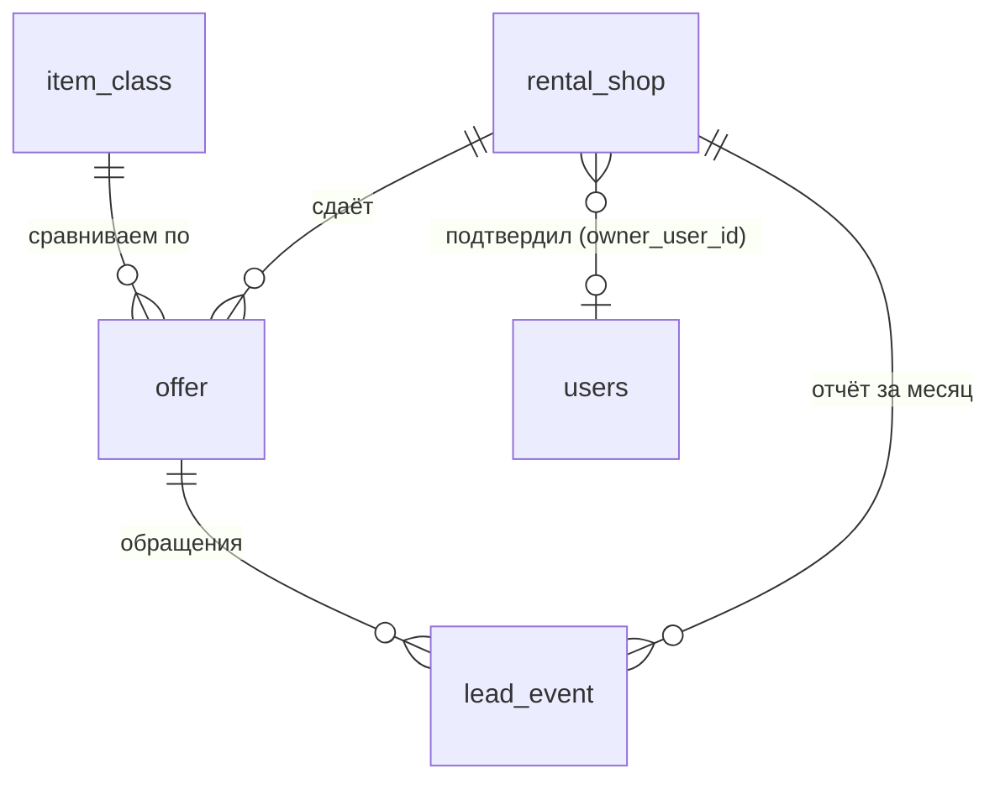

# Модель данных

Черновик схемы — `code/schema.aggregator.ts` (Drizzle, проверен `tsc --strict` на drizzle-orm 0.36).

## Почему новые таблицы, а не переделка объявлений

Объявление (`listing`) принадлежит пользователю. Предложение проката (`offer`) существует без него:
мы создаём его сами из открытых данных, а владелец появляется, только если прокат подтвердит карточку.
Если превратить `listing` в `offer`, права доступа, связи и логика подтверждения перепутаются,
и каждая следующая фича станет дороже. Поэтому объявления остаются как есть (выключены флагом), рядом — новое ядро.

## Таблицы

| Таблица | Что хранит | Ключевые поля |
| --- | --- | --- |
| `item_class` | Класс предмета для сравнения | `category_slug`, `slug`, `name`, `short_hint`, `group_slug`, `seo_word` (prokat/arenda) |
| `rental_shop` | Прокат | `city_slug`, `name`, `district`, контакты, `source_urls`, `status` (unclaimed/claimed/hidden), `owner_user_id` |
| `offer` | Цена и условия проката по классу | `price_day`, `price_week`, `min_days`, `deposit_rub` (null = неизвестен, 0 = нет), `deposit_document`, доставка (`available`, `price`, `free_from`, `same_day`), `verified_at`, `verified_by` |
| `lead_event` | Обращения и сигналы | `type` (show_phone, call, request, regular_request, price_outdated, claim_click), `offer_id`, `shop_id`, `tab`, `rank_position`, `scenario`, `utm` |
| `regular_request` | Заявки «нужен регулярно» | `what`, `frequency`, `contact`, `status` |

## Правила

- Все суммы — целые рубли.
- `verified_at` обязателен. Старше 30 дней — предложение уходит из рейтинга в блок «на перепроверке» (`code/pricing.ts`, `isStale`).
- `deposit_rub = null` показываем как «уточняется» и не считаем «без залога».
- Итог никогда не хранится — считается на лету из `offer` и сценария пользователя (`code/pricing.ts`).
- Прокат на старте заводится импортом CSV (`data/offers.template.csv`), админка не нужна до 8-й недели.

## Импорт

`data/offers.template.csv` — одна строка на предложение. Скрипт импорта: найти или создать `rental_shop`
по (`city_slug`, `shop_name`, `phone`), найти `item_class` по `class_slug`, upsert `offer` по (`shop`, `class`, `model`).
